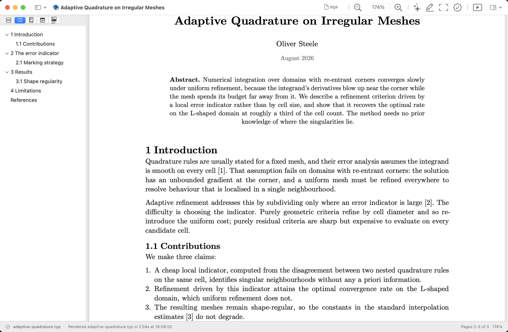

# Typeset Viewer

A native macOS preview and review tool for **Typst, Markdown, LaTeX, and PDF** files. Open a supported file and it renders to a PDF in a native window. The app includes live refresh, notes, review tools, a reading list, and presentation mode.

**Website:** [typeset.osteele.com](https://typeset.osteele.com) · **Download:** [Typeset Viewer 0.8.0 for macOS](https://github.com/osteele/typeset-viewer/releases/download/v0.8.0/TypesetViewer-0.8.0.zip)

> This repository hosts the app's **releases, website, and issue tracker**. Typeset Viewer is free but closed-source; the application source is not included here.

<!-- Add a screenshot:  -->

## Install

1. Download [Typeset Viewer 0.8.0 for macOS](https://github.com/osteele/typeset-viewer/releases/download/v0.8.0/TypesetViewer-0.8.0.zip).
2. Unzip and drag **Typeset Viewer** to your Applications folder.
3. Open it. The app is notarized by Apple, so it launches without security warnings.

**Requirements:** macOS 14 or later (Apple silicon). Typst is bundled. Markdown rendering uses [Pandoc](https://pandoc.org); LaTeX rendering uses `latexmk` (MacTeX/BasicTeX). The app reports when an external tool is missing.

## Features

- **Renders Typst, Markdown, LaTeX, and PDF:** Typst via the bundled `typst`, Markdown via Pandoc, LaTeX via `latexmk`; PDFs open directly.
- **Live refresh:** edit the source in your own editor and the preview re-renders on save, preserving your reading position.
- **Notes & highlights:** annotate rendered text and export notes with context.
- **Document review:** readability, citation coverage, proofreading, and prose-tightening checks as reviewable suggestions.
- **Paper quizzes:** source-backed recall questions with spaced review, persistent progress, and links to each supporting passage.
- **Reading list:** collect papers by arXiv ID or URL; open, search, or export them.
- **Presentation mode:** page-fit slide navigation with an optional iPhone remote.

## Updates

Typeset Viewer updates itself using [Sparkle](https://sparkle-project.org). Use **Check for Updates…** in the app menu, or let it check on its own.

## Website screenshots

The synthetic paper under `fixtures/screenshots/adaptive-quadrature/` is the
canonical source for new and replacement document screenshots.
`screenshots/manifest.json` records their dimensions and capture profile. Run
`just screenshots-check` after changing the page or its images.

To start a clean capture session against a local app bundle:

```sh
just screenshots-launch "/path/to/Typeset Viewer.app"
```

The launcher disables optional `agent-review` integration for that process and
opens a temporary copy of the fixture, so saved windows and per-document state
do not affect the result. Prepare the requested UI state, then run, for example,
`just screenshot selection-minibar`.

Capture recipes require `jq` and ImageMagick. Validation uses Bun and the macOS
`sips` utility.

## Feedback & bug reports

- **Report a bug:** [open an issue](https://github.com/osteele/typeset-viewer/issues/new?labels=bug), or use **Help ▸ Report a Bug…** in the app (it pre-fills your version and environment).
- **Email:** [steele@osteele.com](mailto:steele@osteele.com)

## License

Typeset Viewer is proprietary freeware. See [LICENSE](LICENSE). It bundles third-party tools under their own licenses, including Typst (Apache-2.0).
